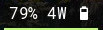

# waybar-modules
A repository of C programs I use for custom waybar modules. 

[Binaries and sums are provided](https://gitlab.com/krathalan/waybar-modules/-/releases) but you can simply build with `make release` in the module directory of your choosing, or run `bash make_release` in the `scripts/` directory of the project to build all modules in each of their directories.

AppArmor profiles are provided in the module directory (e.g. `battery/usr.bin.wbm_battery` for the custom battery module).

## battery


A battery module that displays the current power draw in watts. Displays an additional charging icon when charging. Does not display current power draw in watts when charging.

The program will return, as json data to Waybar, the percentage of the battery. This allows changing the icon based on the battery percentage in your Waybar config.

The program will also return the current state of the battery (charging/discharging), in lowercase. This allows changing the theme based on battery states in your waybar.css.

Here's two example outputs from the program:

```
{"text": "4W ", "class": "discharging", "percentage": 86}
{"text": "", "class": "charging", "percentage": 86}
```

Here's an example module in my Waybar config:

```
  "custom/battery": {
    "interval": 8,
    "tooltip": false,
    "format": "{percentage}% {}{icon}",
    "format-icons": ["", "", "", "", "", "", ""],
    "return-type": "json",
    "exec": "$HOME/path/to/binary/battery"
  },
```

Here's some example Waybar css for this battery module:

```
#custom-battery {
    padding: 0 5px;
    margin: 0 4px;
    background-color: transparent;
    border-bottom: 2px solid #bff874;
    color: #ffffff;
}

#custom-battery.charging {
  border-bottom: 2px solid #00ff96;
}
```

## vpn


This program takes the name of a VPN interface, like "mullvad-us3", and returns json data containing information on the state of the VPN connection. This information can be used to change the theme based on the state of your VPN connection in your waybar.css.

Here's an example module in my Waybar config:

```
"custom/vpn": {
  "interval": 5,
  "tooltip": false,
  "format": "{}",
  "return-type": "json",
  "exec": "$HOME/path/to/binary/vpn mullvad-us5"
},
```

Here's some example Waybar css for this VPN module:

```
#custom-vpn {
    padding: 0 5px;
    margin: 0 4px;
    background-color: transparent;
    border-bottom: 2px solid #00ff96;
    color: #ffffff;
}

#custom-vpn.down {
  border-bottom: 2px solid #dd2241;
}
```

